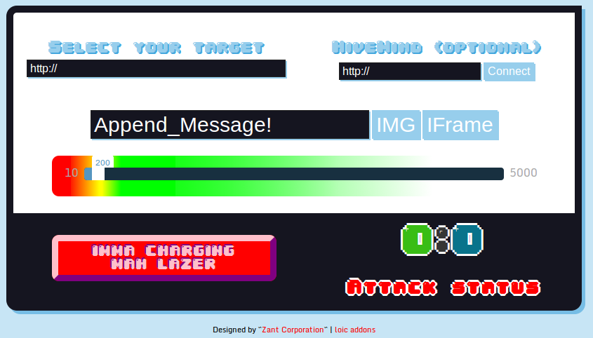

#LOIC

Es una implementación de algunas de las funcionalidad de [LOIC](https://es.wikipedia.org/wiki/Low_Orbit_Ion_Cannon) realizadas en lenguaje JavaScript, lo cual permite ejecutarlo desde un navegador web.

[Instalar](release/loic.firefox.xpi?raw=true) en GNU Icecat, GNU Iceweasel, Seamonkey y Mozilla Firefox.

**Nota:** Este código fuente esta basado en el empaquetado den [cryptocat](https://crypto.cat) y [lowc](https://code.google.com/p/lowc/)

## Enjambre (HiveMind)

Esta opción esta pensada para coordinar ataques entre varias personas, originalmente suelen hacerse con [RSS](https://es.wikipedia.org/wiki/Rss) pero esto todavía no esta soportado por este plugin.

~~~
var info = ({
  "target": "http://www.example.com/", //Obejtivo URL (con "http://").
  "msg": "LOWC - Test tool", //Mensaje.
  "status": "stop" //Estado del ataque ("start" o "stop").
})
~~~
Esto podes publicarlo en un [pasti](http://pastebin.com/) y pasar la URL crudo (raw).
## Parametros

Podes predefinir el target, el hive o el mensaje con parametros

~~~
url.al/pluggin/index.html?t=google.com&msg=Por%20Gatos!&h=hive.fake.com
~~~

## Pendientes

* Chat cifrado bajado en crytocat
* Soportar "ataques" coordinados con RSS
